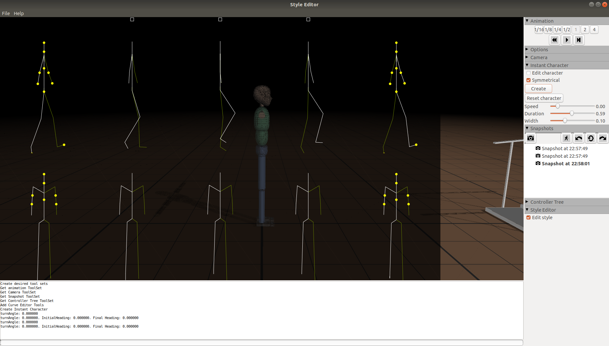
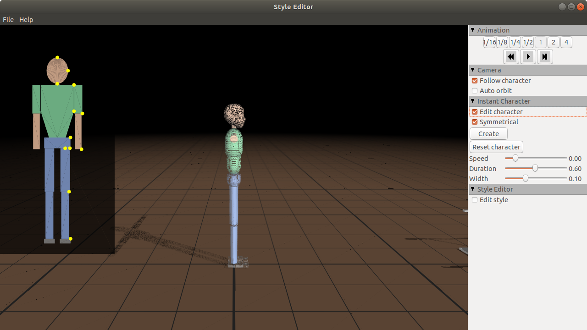

<!-- allowed_elements ["
", "", " ", "<table>", "<tr>", "<td>", "", "<i>", "<b>"] -->
 <table border="0" valign="MIDDLE">
  <tr>
   <td>
    
   </td>
   <td>
    Cartwheel 3D 
    A 3D physics-based character animation framework
   </td>
  </tr>
 </table>

 <i>Code and executable accompanying the SIGGRAPH 2010 paper</i>  
S. Coros, P. Beaudoin and M. van de Panne. <b>Generalized Biped Walking Control</b>. Siggraph 2010. ([project page](http://cs.ubc.ca/~van/papers/2010-TOG-gbwc/index.html))

---

Continuing research on 3D physics-based character animation by the character animation folks at UBC Imager graphics lab. You can [RunTheEditor](./wiki/RunTheEditor.md) right now. Want to compile and execute the project? See [GettingStarted-WIN32](./wiki/GettingStarted-WIN32.md) or [GettingStarted-Linux](./wiki/GettingStarted-Linux.md)! Don't hesitate to join the discussion on the [Cartwheel Google Group](https://groups.google.com/g/cartwheel-3d?pli=1). You might also be interested in our [PreviousProjects](./wiki/PreviousProjects.md).  

### Screenshots ###

The following screenshots depicting edit style and character modes of the Style Editor were captured from `cartwheel-3d` built and run on an Ubuntu 18.04 platform using GNU C++ compiler v8.4, Swig v3.0.12 and Python v2.7.17.

 

  <table border="0" valign="MIDDLE">
   <tr>
    <td>
      <b>Edit Style Mode</b>
    </td>
   </tr>
   <tr>
    <td>
     
    </td>
   </tr>
   <tr>
    <td>
      <b> Edit Character Mode</b>
    </td>
   </tr>
   <tr>
    <td>
     
    </td>
   </tr>
  </table>
 
 

### Videos ###

See the YouTube videos of the SIGGRAPH 2010 Generalized Biped Walking Control project:

  * [Part 1](https://www.youtube.com/watch?v=lOxeyyooDmw)
  * [Part 2](https://www.youtube.com/watch?v=MHj8RDfyqP0)

and sample `cartwheel-3d` execution on Linux demonstration videos:

  * [BasicEditor](https://youtu.be/pgX6k8qZzKI) - screen capture using SimpleScreenRecorder
  * [BasicWalker](https://youtu.be/6bCgt1Kw17w) - screenshot BMP images converted to MP4 using ffmpeg <RB>

 
Projects owners:

 * [Stelian Coros](http://crl.ethz.ch/people/coros/index.html)
 * [Philippe Beaudoin](https://scholar.google.ca/citations?user=SUbqiqwAAAAJ&hl=en)
 * [Michiel van de Panne](http://cs.ubc.ca/~van)
